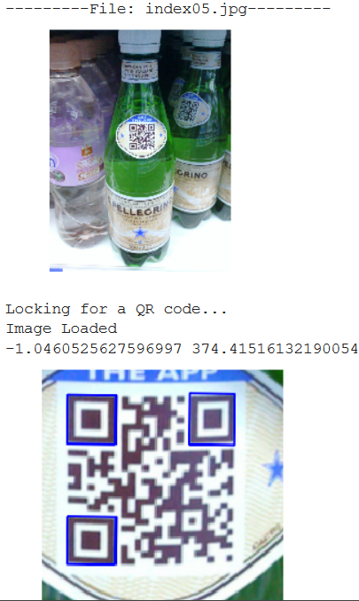

# Qr-code-Extraction-
Qr code extraction from any Image 
This code can be used to extract qr codes from images of various configuration . No need for the qr code to be in focus instead this Opencv based python code will help you out to find the qr code
For more imformation and to see the results do vist my collab notebook 
https://colab.research.google.com/drive/1w0JAgKaL83gC1KZF6MbCORRe5x5cTjw5

